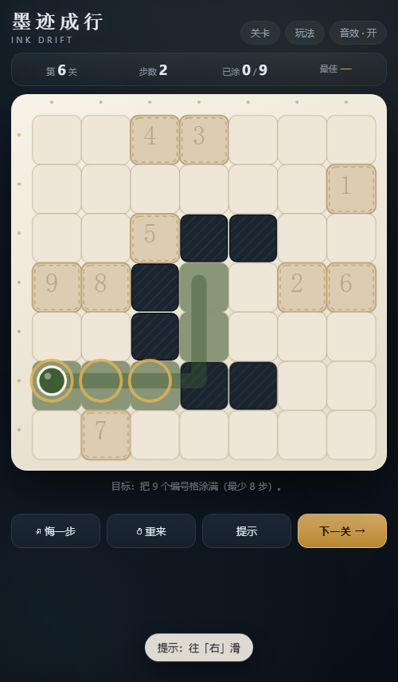

# 墨迹成行 · Ink Drift

一个滑行成画的小游戏。棋子朝一个方向**一直滑到撞墙**才停下，沿途经过的每一格都会染上墨色。
把棋盘上所有带编号的浅色格子涂满就过关，步数越少评价越高。

```
双击 index.html 即可开玩（无需服务器、无任何依赖、纯手写 JS）
```

## 玩法

| 操作 | 说明 |
| --- | --- |
| `↑ ↓ ← →` / `W A S D` | 朝该方向滑行一步 |
| 手机滑动屏幕 | 同上 |
| `Z` | 悔一步 |
| `R` | 重来本关 |
| `H` | 提示下一步 |
| `N` | 下一关 |
| `Esc` | 关闭弹层 |

规则细节：

- **撞墙不算步数**。贴边或撞墙只会抖一下，可以放心试探。
- **墙是可以"贴上去"的落脚点**：棋子撞墙时停在墙格上，所以棋盘里任何一格都可能成为落脚点 ——
  这样关卡的解法空间比"停在墙前"大得多，也才有深一点的谜题。
- 每关有一个**理论最少步数**（游戏内置求解器算出），达到即 ★★★；接近是 ★★；再多也能通关，只是 ★。
  也就是说**永远可以过关**，不会卡死。
- 12 关之后是**无尽即兴局**：每次随机生成一张新棋盘，保证有解。

## 玩法之外的细节

- 进度、每关最佳步数与星级存在 `localStorage`（键名 `ink-drift.save.v1`），换关/刷新都不丢。
- 音效是极简 WebAudio 现场合成的（滑行摩擦声、上色叮声、过关琶音），可一键关掉。
- 键盘操作在弹层打开时会被拦截，避免误触；首次进入自动展示玩法说明。
- 支持 `prefers-reduced-motion`，标签页切到后台时动画会由兜底定时器收尾，输入不会被锁死。
- URL 参数：`?level=5` 直接进第 5 关，`?endless=1` 进即兴局，`?nointro=1` 跳过玩法说明。



## 目录结构

```
ink-drift/
├── index.html          页面骨架
├── style.css           全部样式（宣纸 + 水墨的配色）
├── game.js             全部游戏代码：关卡数据 / 滑行规则 / 求解器 / 生成器 / 渲染 / 音效
├── tests/
│   ├── verify.js       关卡数据自检：合法性、可解性、最优步数、生成器稳定性
│   └── smoke.js        无浏览器冒烟测试：自建迷你 DOM 把 game.js 真跑一遍，12 关逐关自动通关
└── tools/
    ├── tune-levels.js  调参：从可达格集合里挑目标组合，输出步数合适的候选
    ├── find-seeds.js   给"手写墙做不出深度"的关卡搜生成器种子
    └── screenshot.js   用 DevTools Protocol 驱动真实 Chrome 截图（自动跳过说明弹层、代打几步）
```

## 开发

```bash
node tests/verify.js      # 关卡与规则检查（不需要浏览器）
node tests/smoke.js       # 假 DOM 里跑完整游戏，含 12 关自动通关
node tools/tune-levels.js 4            # 为现有墙体布局推荐目标组合
node tools/tune-levels.js 4 --measure  # 测量每张布局最多能做到多少步
node tools/find-seeds.js               # 搜索生成器种子（输出可直接抄进 DERIVED）
node tools/screenshot.js 6 out.png "ArrowDown,ArrowRight"   # 真实浏览器截图
```

`game.js` 底部会把纯逻辑部分（关卡、`simulate`、`solve`、`genLevel` 等）通过
`module.exports` 暴露出来，所以测试脚本能在 Node 里直接复用同一套规则，
不会出现"测试和游戏两份逻辑"的漂移。

### 关卡是怎么设计的

手写关卡（第 1、2、3、5、6、8、12 关）靠人摆墙、调参工具挑目标；
其中第 4、7、9、10、11 关的墙体是用 `find-seeds.js` 搜出来的种子，在运行时由
`genLevel()` 确定性展开（种子固定 → 每次打开都是同一张棋盘）：

```js
{ name: '回廊', derived: { seed: 25, size: 6, walk: 10 } }
```

`genLevel()` 的思路是"先走后摆墙"：随机滑行出一条路径，再把路径没碰过的格子全变成墙 ——
于是这条路径本身就是一个合法解，**结果必然可解**。`walk` 越大，走廊越长、解法通常也越深。

### 踩过的三个坑（都写进了测试）

1. **视觉与逻辑脱节**：一开始 `paintCells()` 内部用 `state.painted` 判断"这格要不要上色"，
   而 `move()` 已经先把新格子写进了 `state.painted`，导致所有格子都被判定为"已上色"而跳过 ——
   计量数字在涨，棋盘却一点颜色都没有。现在逻辑与视觉分开推进，并且 `smoke.js` 会
   逐格核对棋盘上的染色数量是否与 HUD 一致。
2. **弹层依赖 HTML 默认状态**：`boot()` 原本假设 `hidden` 属性一定存在，
   一旦有弹层残留就会把所有键盘输入吞掉。现在启动和切关都会显式关闭全部弹层。
3. **CSS 覆盖了 `[hidden]`**：`.overlay` 设了 `display: flex`，它的优先级高于浏览器
   给 `hidden` 属性准备的 `display: none`，结果**弹层永远关不掉、整个游戏点不动**。
   假 DOM 测试完全看不到这个（它不做样式计算），是 `tools/screenshot.js` 把真实浏览器的
   `getComputedStyle()` 打出来才抓到的。现在 CSS 里显式写了 `.overlay[hidden] { display: none !important }`。

教训：纯逻辑测试和无头 DOM 测试能覆盖规则，但**渲染与层叠必须让真实浏览器看一眼**。
